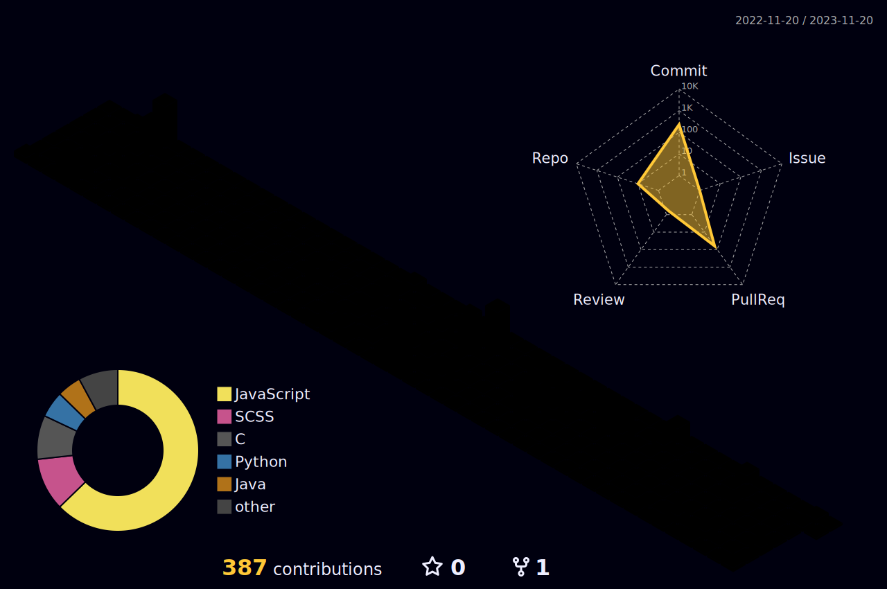

  

###

<h1 align="center">Hi there 👋 I'm Nisa</h1>

###

I'm a senior computer engineering student & a full-stack developer from Türkiye  - 🔭 I’m working as a full-stack developer at Seiemens - 📚 I'm currently learning Spring Boot & Angular

###

<h3 align="left">🛠 Language and tools</h3>

###

  
  
  
  
  
  
  
  
  
  
  
  
  
  
  
  
  
  
  
  
  
  
  
  
  
  
  
  
  
  
  
  
  
  
  

###

###

  
  

###

  

###
